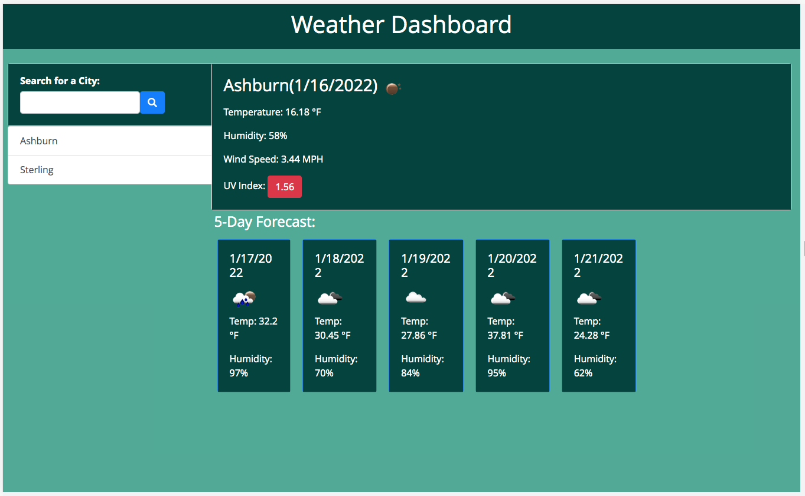

# Weather Dashboard

This is challenge is to build a weather dashboard that will run in the browser and feature dynamically updated HTML and CSS.

Use the [OpenWeather One Call API](https://openweathermap.org/api/one-call-api) to retrieve weather data for cities. And will use localStorage to store any persistent data.

## Installation

1. Create new repository
2. Use a text editor, Visual Studio Coding view and coding.

## Function 

* When searched for a city, the current and future conditions for that city will be presented and that city is added to the search history

* When viewing current weather conditions for the city, the following is shown:
    * City name
    * Date
    * An icon representation of weather conditions
    * Temperature
    * Humidity
    * Wind speed
    * UV index

* When viewing the UV index, it is presented with a color indicating severity

* When viewing the future weather conditions for the city, a 5-day forecast will be presented with the following information:
    * Date
    * An icon representation of weather conditions
    * Temperature
    * Humidity

* When a city in the search history is clicked, the current and future conditions for that city is presented again

* When the weather dashboard is opened, the last searched city forcast is presented

## Features

* HTML
* CSS
* Bootstrap
* jQuery
* Moment.js
* Server-Side API

## Demo
https://nfoithong.github.io/Weather-Dashboard-V1/
## Github Website
https://github.com/NFoithong/NF-Weather-Dashboard-V1.git

## Screenshot

